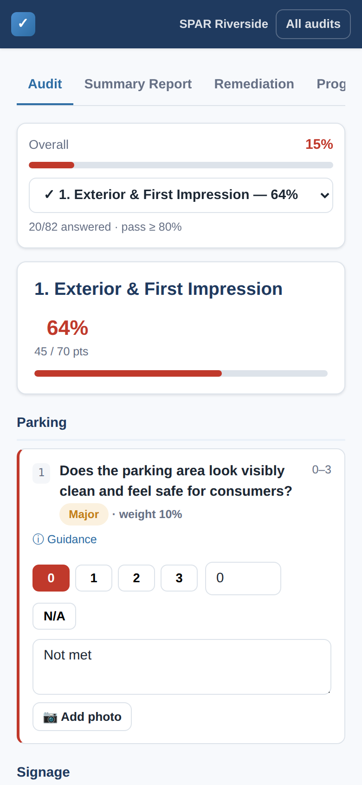
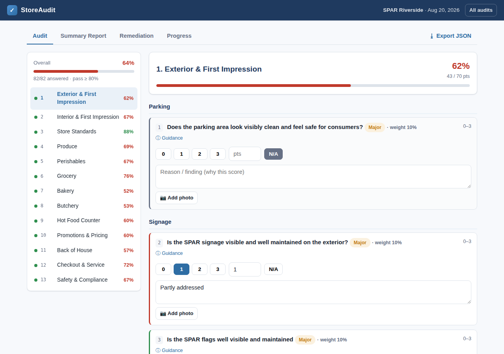
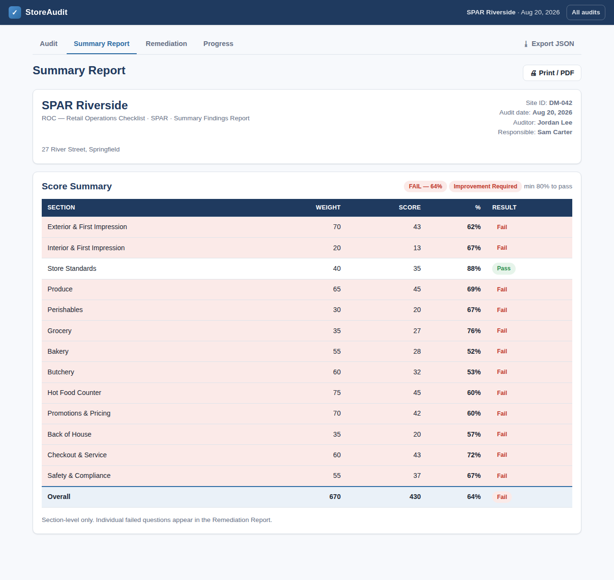
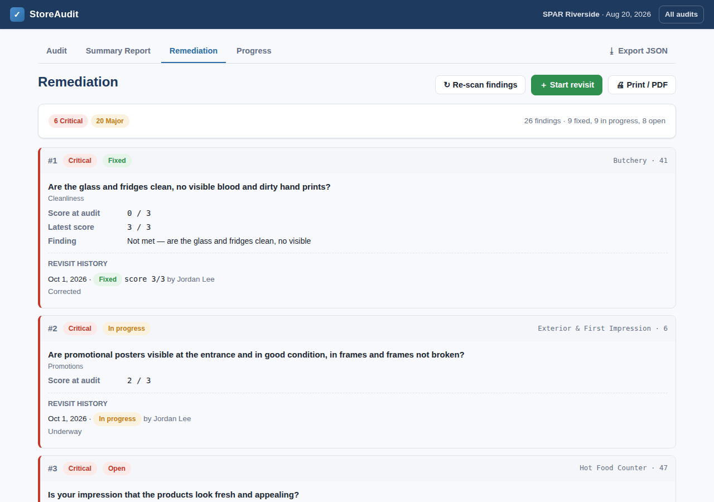
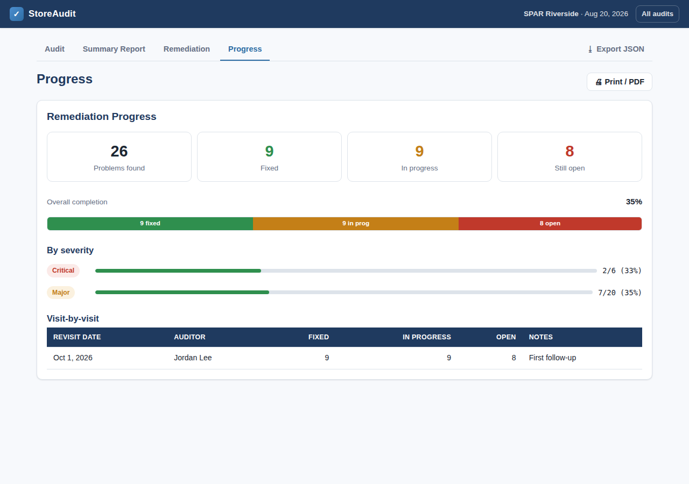

# StoreAudit

A self-contained web app for retail store auditing, remediation planning, and
follow-up reassessment. Built for a field auditor who picks the audit that
matches the store type, works through a weighted checklist, presents section-level
findings to the store owner, hands over an actionable remediation report, and
returns on later visits to record how far the owner has progressed in fixing the
delinquent findings.

It carries **two audits, chosen by store type**, from the source spreadsheet in
[`samples/`](samples/):

| Audit | Store types | Questions | Sections |
|---|---|---|---|
| **ROC** | SUPERSPAR · SPAR · SAVEMOR | 82 | 13 |
| **RTTT** | TOPS | 53 | 9 |

> **No install, no server, works offline.** It's plain HTML/CSS/JavaScript with
> the checklist data embedded. Open `index.html` in any modern browser, or host
> the folder on GitHub Pages.

> **Phone-friendly.** The layout is responsive: on a phone the section sidebar
> becomes a compact dropdown so questions are visible immediately, the tab bar
> scrolls sideways, and **📷 Add photo** opens the camera directly.
> <br>

## Screenshots

| Audit | Summary report |
|---|---|
|  |  |

| Remediation | Progress |
|---|---|
|  |  |

## What it does

1. **Choose the store type** on the New Audit screen — TOPS runs the **RTTT**
   audit; SUPERSPAR / SPAR / SAVEMOR run the **ROC** audit. The app loads only
   that audit's questions.
2. **Audit** — work section by section. Each question is scored **0–3**, with a
   reason and an optional photo, or marked **N/A**. Section and overall
   percentages update live against the **80% pass mark**, and the overall %
   shows its **rating band** (Platinum → Improvement Required).
3. **Summary report** — a section-level Pass/Fail table (Weight · Score · %) with
   the overall rating. Print or save to PDF from the browser.
4. **Remediation report** — automatically lists every **Critical or Major**
   question scored below full marks (Partial findings are not chased), ordered
   Critical-first, each carrying the question's built-in severity.
5. **Revisit & reassessment** — on a later visit, load the store's file and mark
   each item **Fixed / In progress / Open**, with an optional new score and photo
   as evidence. The original audit is never altered.
6. **Progress** — a before → after view: *problems found → fixed / in progress /
   open*, a completion bar, a severity breakdown, and a visit-by-visit history.

See [`docs/PROCESS.md`](docs/PROCESS.md) for the full workflow and the scoring
model, or [`docs/Workflow_ROC_RTTT.docx`](docs/Workflow_ROC_RTTT.docx) for the
formatted version.

## How scoring works

Every question is scored **0–3** and carries a **Weight (%)** and a built-in
**severity** (Critical / Major / Partial). A section's (and the overall) score is
the weighted average:

```
% = sum(score ÷ 3 × weight) ÷ sum(weight)      (N/A questions excluded)
```

The store **passes at 80%**, and the overall % is graded into a rating band:
Platinum (95–100), Gold (90–94), Silver (80–89), Bronze (70–79), else Improvement
Required.

## Data & storage

- Each audit is one **JSON file named `<Store>_<Date>.json`** and records which
  audit set (ROC / RTTT) and store type it used.
- **Export JSON** downloads that file; **Import JSON** loads it back on a revisit.
- The browser also keeps a working copy in `localStorage`, so audits survive a
  page reload on the same device. The exported file is the portable record to
  keep and reopen on revisits.
- **Revisits are appended** to the same file (a dated list of status/score/photo
  updates per item). A new full audit starts a new file.

Photos are downscaled and embedded in the JSON as data URLs, so a file is fully
self-contained.

## Running it

**Locally:** open `index.html` in a browser (double-click, or `File → Open`).

**GitHub Pages:** enable Pages for this repo (Settings → Pages → deploy from the
branch's root). The app is fully static; a `.nojekyll` file is included.

## Project structure

```
index.html                 App shell
css/styles.css             Styles (responsive, print-friendly)
js/checklist-data.js       Embedded checklist (generated) — window.CHECKLIST
js/model.js                Data model, persistence, scoring, remediation logic
js/reports.js              Printable report renderers (summary, remediation, progress)
js/app.js                  Views, router, audit/remediation/revisit interactions
data/questions.json        Both audit sets (human-readable source of truth)
tools/build_questions.py   Regenerates data/questions.json + js/checklist-data.js
samples/                   Source spreadsheet (RTTT_and_ROC_Checklist.xlsx)
docs/                      Process docs (Markdown + Word) and screenshots
```

## Regenerating the checklist data

If the source spreadsheet changes, rebuild the data files:

```bash
python3 tools/build_questions.py      # needs: pip install openpyxl
```

This reads `samples/RTTT_and_ROC_Checklist.xlsx` (the `ROC_Audit` and `RTTT` tabs)
and rewrites both `data/questions.json` and `js/checklist-data.js`. The store-type
→ audit mapping and the rating bands are defined at the top of that script.
